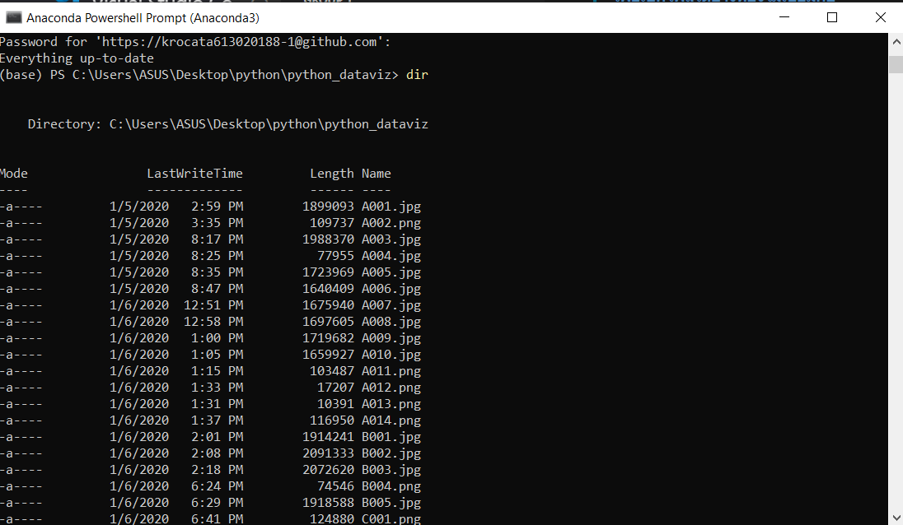

# python_dataviz

นายกรวิชญ์ ทะรังศรี 613020188-1 
สาขาสถิติ ชั้นปีที่ 2

## **วิธีการติดตั้ง python3.7 โดยติดตั้งผ่านโปรแกรม Anaconda**
### **1.ให้เปิดเว็บบราวเซอร์แล้วพิมพ์ anaconda python แล้วคลิกที่ [Anaconda Python/R Distribution - Anaconda](https://www.anaconda.com/distribution/)**

 ### **2.เมื่อเข้าสู่เว็บไซต์ให้เลื่อนลงมาที่ด้านล่างจะพบเมนูให้เลือกดาวน์โหลดดังภาพ ซึ่งมีให้เลือกทั้งระบบปฎิบัติการ Windows, MacOs และ Linux แนะนำให้เลือกเวอร์ชั่น 3.7**

### **3.เมื่อดาวน์โหลดไฟล์ตัวติดตั้งเสร็จให้ดับเบิลคลิกที่ตัวติดตั้งดังภาพ**

### **4.เมื่อปรากฎหน้าจอแสดงเวอร์ชั่นตัวติดตั้งของ Anaconda ดังภาพ**

### **5.จากนั้นจะแสดงหน้าจอเกี่ยวกับการยอมรับสิทธิ์ ให้เรากดปุ่มดังถาพเพื่อยอมรับการติดตั้ง**

### **6.เลือกรูปแบบการติดตั้งจะใช้เพียงคนเดียว (Just Me) หรือทุกคนที่ใช้เครื่องนี้ (All Users) ในที่นี้เลือกติดตั้งใช้งานเพียงคนเดียวจากนั้นคลิกปุ่มดังภาพ**

### **7.เลือกตำแหน่งการการติดตั้ง สามารถกดปุ่ม next ผ่านไปได้เลย**

### **8.เมื่อปรากฏหน้าจอดังภาพ ให้คลิกปุ่ม install ดังภาพเพื่อเริ่มการติดตั้ง**

### **9.หลังจากติดตั้งเส็จให้กดปุ่ม next**

### **10.หลังจากนั้นให้คลิกปุ่ม finish เพื่อสิ้นสุดการติดตั้ง**

### **11.เมื่อดาวน์โหลดเสร็จแล้วให้เปิด Anaconda Powershell Prompt ดังภาพ**

### **12.เช็คว่าในเครื่องมี python แล้วหรือไม่โดยการพิมพ์คำสั่ง python ถ้าได้ผลดังภาพแปลว่ามีโปรแกรมในเครื่องแล้ว**

### **13.เปิดใช้งาน jupyter notebook เพื่อเขียน python ได้โดยพิมพ์คำสั่ง jupyter notebook ดังภาพ** 

### **14.จากนั้นจะปรากฎหน้าต่างเข้าใช้งาน Jupyter Notebook ผ่านทางเว็บบราวเซอร์ดังภาพ**

## **การใช้งาน colab**

### **Google colab นั้นสามารถใช้เขียน pytho บนเว็บบราวเซอร์ได้ฟรี โดยไม่จำเป็นต้องติดตั้งโปรแกรม โดยแนะนำให้เขียนผ่านเว็บบราวเซอร์ของ Google chrome โดยจะมีขึ้นตอนการใช้งานดังนี้**

### **1.ให้เปิดเว็บบราวเซอร์ขึ้นมาแล้วพิมพ์ google colab แล้วคลิกที่ [Google colab](https://colab.research.google.com/notebooks/welcome.ipynb) ดังภาพ**

### **2.เมื่อเข้ามาที่หน้าเว็บไซต์ ให้ทำการ sign in ด้วย gmail หรือ kkumail**  

### **3.เมื่อ sign in เข้ามาแล้วให้คลิกที่ File แล้วคลิก new python3 notebook ดังภาพ**

### **จะปรากฏเว็บบาวเซอร์ดังภาพและสามารถใช้งานการเขียน python ได้เลย**

### **4.เมื่อทำงานเสร็จและต้องการดาวน์โหลดไฟล์สามารถทำได้โดยคลิกที่ file แล้วคลิกที่ download .ipynb หรือ download .py ดังภาพ**

## **การใช้งาน github**

### **1.ให้เปิดเว็บบราวเซอร์ขึ้นมาแล้วพิมพ์ github แล้วคลิกที่ The world's leading software development platform · GitHub**

### **2.หากเข้ามาในเว็บไซต์แล้วยังไม่ได้ทำการสมัครให้กด sign up ดังภาพ**

### **3.เมื่อสมัครเสร็จจะแสดงเว็บบราวเซอร์ดังภาพให้ทำการตั้งชื่อโปรเจคตรงช่องที่ลูกศรสีฟ้าชี้อยู่ และตั้งค่า Pubilc ตรงลูกศรสีเหลืองเพื่อให้ทุกคนสามารถดูโปรเจคของคุณได้ หรือเลือก Private เมื่อคุณต้องการความเป็นส่วนตัวในการทำโปรเจคทำให้ไม่มีใครสามารถดูโปรเจคคุณได้**

### **4.ทำการติดตั้ง git บน Anaconda โดยการเปิดเว็บบราวเซอร์แล้วพิมพ์ [anaconda install git แล้วคลิก Git :: Anaconda Cloud](https://anaconda.org/anaconda/git)**

### **5.เมื่อเข้ามาในเว็บไซต์แล้วให้ก็อปปี้code ตรงที่ลูกศรชี้ดังภาพไปใส่ใน Anaconda Powershell Prompt**

### **6.เมื่อทำการติดตั้งเสร็จแล้วให้เราเข้าไปที่โปรเจคของเราใน github แล้วคลิกที่ clone or download แล้วคลิกก็อปปี้ลิงค์ดังภาพ**

### **7.เปิด Anaconda Powershell Prompt ขึ้นมาและเข้าไปยังไฟล์ที่ต้องการจะเก็บโปรเจคโดยการพิมพ์คำสั่ง 'cd' เว้นวรรค ตามด้วยที่อยู่ไฟล์ดังภาพ**

### **8.ทำการเชื่อมต่อไฟล์กับโปรเจคในgithub โดยการพิมพ์คำสั่ง 'git clone' เว้นวรรคแล้วตามด้วยลิงค์ที่ก็อปมาจาก clone or download ในข้อที่6และเมื่อเคยทำการ git clone แล้วจะเป็นดังภาพและคำสั่งนี้ใช้เพียงครั้งเดียวเมื่อเริ่มโปรเจค**

### **9.พิมพ์ 'git status' เพื่อเช็คไฟล์ใดบ้างที่ยังไม่เชื่อมกับ git hub**

### **10.พิมพ์ 'git add' เพื่อเพิ่มไฟล์ที่จะอัพเดตขึ้น github**

### **11.พิมพ์ 'git commit -m " "' เพื่อบอกว่าเรากำลังทำอะไร**

### **12.พิมพ์ 'dir' เพื่อดูว่มีอะไรเชื่อมกับ git hub แล้วบ้าง**

### **13.พิมพ์ 'git push' และให้เราใส่ Username และ Password ของ git hub เพื่อเป็นการอัพไฟล์ลงโปรเจคของเราใน github**

## **การใช้งาน visual studio code**

### **1.ให้เปิดเว็บบราวเซอร์ขึ้นมาแล้วพิมพ์ visual studio code แล้วคลิก [Visual Studio Code - Code Editing. Redefined](https://code.visualstudio.com/)**

### **2.เมื่อเข้าสู่เว็บไซต์แล้วให้กดดาวน์โหลดดังภาพ**

### **3.เมื่อดาว์โหลดและติดตั้งเสร็จเรียบร้อยแล้วให้เปิด Anaconda Powershell Prompt ขึ้นมาแล้วพิมพ์คำสั่ง cd เว้นวรรคตามด้วยพี่อยู่ไฟล์ที่เก็บโปรเจคแล้วใช้คำสั่ง code . เพื่อเปิดโปรแกรม  visual studio code**

### **4.จะปรากฏโปรแกรมดังภาพ**

### **5.เมื่อทำงานเสร็จให้ทำการ save และใช้คำสั่ง git add,git commit -m " ",และ git push ตามขั้นตอนด้านบน**